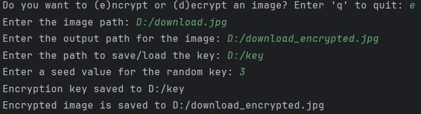

# Image Encryption Tool Using Pixel Manipulation

## English

### Project Description

This project provides a simple image encryption tool that uses pixel manipulation to encrypt and decrypt images. The tool allows users to swap pixel values based on a random key, ensuring the confidentiality of the image data.

### Features

- Encrypts and decrypts images by swapping pixel values.
- Supports both color (RGB) and grayscale images.
- Uses a seed value for generating reproducible random keys.
- Saves and loads encryption keys for secure decryption.

### Installation

1. Clone the repository:
    ```bash
    git clone https://github.com/yourusername/image-encryption-tool.git
    cd image-encryption-tool
    ```

2. Install the required packages:
    ```bash
    pip install -r requirements.txt
    ```

### Usage

1. **Encrypt an Image:**
    ```bash
    

    python encrypt_decrypt.py
    ```
    Follow the prompts to enter the image path, output path, key path, and seed value for encryption.

2. **Decrypt an Image:**
    ```bash
    python encrypt_decrypt.py
    ```
    Follow the prompts to enter the image path, output path, and key path for decryption.

### Example

To encrypt an image:
```bash
python encrypt_decrypt.py
